# CitasApp — Diagrama C4 Nivel 3 (Componentes)

**Alcance:** contenedor `CitasApp.Api`, el que mejor expone la arquitectura hexagonal y los tres patrones GoF (Factory Method, Observer, Decorator).

**Nota:** el contenedor `CitasApp` (Web MVC) reutiliza los mismos componentes de `Domain` e `Infrastructure`, pero **no** pasa por `CitasApp.Application` (sus controladores inyectan los repositorios directamente). Ese detalle se documenta aparte y no se dibuja en este nivel para no mezclar dos flujos distintos.

```mermaid
C4Component
title Diagrama de Componentes (C4 Nivel 3) — Contenedor: CitasApp.Api

Person(cliente, "Cliente API", "Aplicación externa o Postman/PowerShell que consume la API REST")

Container_Boundary(api, "CitasApp.Api (ASP.NET Core Web API)") {
    Component(pacientesCtrl, "PacientesController", "ControllerBase", "Expone endpoints GET de pacientes")
    Component(medicosCtrl, "MedicosController", "ControllerBase", "Expone endpoints GET de médicos")
    Component(citasCtrl, "CitasController", "ControllerBase", "Expone endpoints de citas (listar, por paciente, confirmar)")
    Component(calcCtrl, "CalculadoraController", "ControllerBase", "Endpoints aritméticos independientes del dominio")
}

Container_Boundary(application, "CitasApp.Application") {
    Component(pacienteSvc, "PacienteService", "Clase C#", "Casos de uso de Paciente")
    Component(medicoSvc, "MedicoService", "Clase C#", "Casos de uso de Médico")
    Component(citaSvc, "CitaService", "Clase C#", "Casos de uso de Cita; mantiene la lista de ICitaObserver y los notifica al confirmar")
}

Container_Boundary(domain, "CitasApp.Domain (Puertos + Modelos)") {
    Component(iPacienteRepo, "IPacienteRepository", "Interfaz (Puerto)", "Contrato de persistencia de Paciente")
    Component(iMedicoRepo, "IMedicoRepository", "Interfaz (Puerto)", "Contrato de persistencia de Médico")
    Component(iCitaRepo, "ICitaRepository", "Interfaz (Puerto)", "Contrato de persistencia de Cita")
    Component(iCitaObs, "ICitaObserver", "Interfaz (Puerto)", "Contrato de notificación de citas")
    Component(modelos, "Cita / Medico / Paciente", "Entidades de dominio", "Modelos puros sin dependencias externas")
}

Container_Boundary(infra, "CitasApp.Infrastructure (Adaptadores)") {
    Component(factory, "RepositoryFactory", "«Factory Method»", "Decide qué implementación concreta de repositorio crear según el entorno")
    Component(loggingDecorator, "LoggingPacienteRepository", "«Decorator»", "Envuelve un IPacienteRepository y agrega logging con timestamp")
    Component(jsonPacienteRepo, "JsonPacienteRepository", "Adaptador", "Persistencia de Paciente en JSON")
    Component(jsonMedicoRepo, "JsonMedicoRepository", "Adaptador", "Persistencia de Médico en JSON")
    Component(jsonCitaRepo, "JsonCitaRepository", "Adaptador", "Persistencia de Cita en JSON")
    Component(smsObs, "SmsObserver", "«Observer» concreto", "Simula envío de SMS de recordatorio")
    Component(emailObs, "EmailObserver", "«Observer» concreto", "Simula envío de confirmación por correo")
}

ContainerDb(datos, "Archivos de datos", "JSON", "pacientes.json, medicos.json, citas.json")

Rel(cliente, pacientesCtrl, "GET /api/pacientes", "HTTPS/JSON")
Rel(cliente, medicosCtrl, "GET /api/medicos", "HTTPS/JSON")
Rel(cliente, citasCtrl, "GET/POST /api/citas", "HTTPS/JSON")
Rel(cliente, calcCtrl, "GET /api/calculadora", "HTTPS/JSON")

Rel(pacientesCtrl, pacienteSvc, "usa")
Rel(medicosCtrl, medicoSvc, "usa")
Rel(citasCtrl, citaSvc, "usa")

Rel(pacienteSvc, iPacienteRepo, "depende de")
Rel(medicoSvc, iMedicoRepo, "depende de")
Rel(citaSvc, iCitaRepo, "depende de")
Rel(citaSvc, iCitaObs, "notifica vía")

Rel(pacienteSvc, modelos, "manipula")
Rel(medicoSvc, modelos, "manipula")
Rel(citaSvc, modelos, "manipula")

Rel(factory, iPacienteRepo, "crea instancia de")
Rel(factory, iMedicoRepo, "crea instancia de")
Rel(factory, iCitaRepo, "crea instancia de")

Rel(loggingDecorator, iPacienteRepo, "implementa")
Rel(loggingDecorator, jsonPacienteRepo, "envuelve / delega en")
Rel(jsonMedicoRepo, iMedicoRepo, "implementa")
Rel(jsonCitaRepo, iCitaRepo, "implementa")

Rel(smsObs, iCitaObs, "implementa")
Rel(emailObs, iCitaObs, "implementa")

Rel(jsonPacienteRepo, datos, "lee/escribe", "pacientes.json")
Rel(jsonMedicoRepo, datos, "lee/escribe", "medicos.json")
Rel(jsonCitaRepo, datos, "lee/escribe", "citas.json")

UpdateLayoutConfig($c4ShapeInRow="4", $c4BoundaryInRow="1")
```

## Lectura del diagrama

- **Factory Method:** `RepositoryFactory` es el único punto que decide qué adaptador concreto (`JsonPacienteRepository`, etc.) se instancia según el entorno; los servicios de `Application` nunca conocen esa decisión, solo el puerto (`I*Repository`).
- **Decorator:** `LoggingPacienteRepository` implementa el mismo puerto `IPacienteRepository` que envuelve, permitiendo apilar logging sin tocar `JsonPacienteRepository`.
- **Observer:** `CitaService` no conoce a `SmsObserver` ni a `EmailObserver` directamente — solo a la interfaz `ICitaObserver`. Ambos observadores se registran desde `Program.cs` (composition root) y se disparan al confirmar una cita.
- Los cuatro paquetes (`Api`, `Application`, `Domain`, `Infrastructure`) respetan la regla de dependencia hexagonal: las flechas de dependencia siempre apuntan hacia `Domain`, nunca al revés.
